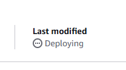

# How to Deploy a Secure Serverless Static Website on AWS: S3, CloudFront, Route 53 & ACM

This repository showcases my AWS projects and lessons learned while deploying a static website using various AWS services.

## AWS Services Used

- **Amazon S3** – To store static website files
- **CloudFront** – To distribute content globally with low latency
- **Route 53** – To manage the domain name
- **AWS Certificate Manager** – To enable HTTPS with SSL/TLS

---

## AWS Architecture Diagram

---

## Deployment Steps

### Step 1: Purchase a Domain and Configure Route 53
> **Note:** If you are using a domain from an external registrar (ex., Namecheap, GoDaddy, IONOS), check the **"For domains registered with an external registrar"** section below for additional steps. 
1. Open the AWS Route 53 console.
2. Navigate to Domains > Registered Domains and click Register Domain.
3. Search for an available domain name, select one, and complete the registration.
> **Note:** .click Domains are typically the cheapest starting at $3 
(Optional) You may deselect the option to "Auto-Renew"
4. AWS will automatically configure Route 53 as the DNS service for your domain.
> **Note:** DNS propagation (can take from a few minutes to 48 hours).

*(Optional)* **For domains registered with an external registrar:**  
  > **Example:**  (Namecheap, GoDaddy, IONOS, etc)
1. Purchase your domain from your preferred registrar.
2. Open the AWS Route 53 console and navigate to **Hosted Zones**.
3. Click **Create Hosted Zone**, enter your domain name, and select **Public Hosted Zone**.
4. Copy the four **Nameservers (NS records)** provided by AWS.  
   > **Note:** Copy the Name Servers without the ending "." (ex., `ns-1001.exam-ple.co.uk`).
5. Update your NS records at your external registrar by locating the Name Server portion in the DNS/Domain Manage settings (this step varies by provider).
> **Note:** DNS propagation (can take from a few minutes to 48 hours).

### Step 2: Create an S3 Bucket for Static Website Hosting
1. Open the **Amazon S3** console.
2. Create a new bucket and name it the same as your domain (ex., `example.com`).
3. Uncheck "Block *all* public access
4. Check "I acknowledge..." to Turn off block all public access, then Create Bucket.
5. Under the Objects tab in your Bucket settings, Click "Upload".
6. Upload your static website files.  
   - The necessary files are located in the **Resources** folder of this repository called **index.html**.
7. Under Bucket's **Properties** Tab, scroll down to "Static website hosting" > "Edit" > "Enable".
8. Choose "Host a static website".
9. Enter the index document name (ex. index.html which again is the one from the Resources folder), Then Click Upload.

### Step 3: Configure Permissions
1. Under Bucket's **Permissions** Tab, Edit the **Bucket Policy** to allow public read access.
   - The **Bucket Policy** file is also found in the **Resources** folder. (Copy code from this file then paste into Bucket Policy) 
    > **Note:** You will need to change the `Bucket-Name` within the code, to your Bucket Name. Then **Save Changes**
2. Test to confirm Website is up and running by going to **Objects** > **index.html** > **Open**. 

### Step 4: Set Up CloudFront for Content Distribution
1. Go to the **CloudFront** console.
2. Create a new CloudFront distribution and point it to your S3 bucket’s static content by selecting **Use website endpoint.** when prompted.
3. Enable HTTPS and customize cache settings. (Ensures secure and encrypted content delivery).????????????????????????? need this part?
4. Under Viewer Protocol Policy:
   - Select either Redirect HTTP to HTTPS or HTTPS Only to enhance security.
5. Choose weather you would like to Enable or Disable **Web Application Firewall (WAF).** based on your security needs.
6. Under the **Alternate domain name (CNAME) - optional** field, enter your custom domain name (ex., example.com or www.example.com).
    > **IMPORTANT:** Configuring a CNAME allows you to access your website using your custom domain.
> *From here continue to Step 4.5*
### Step 4.5: Request an SSL Certificate in AWS Certificate Manager
7. Under "Custom SSL certificate - optional", choose **"Request Certificate"**
    > **Note:** May also do this by going to the AWS Certificate Manager (ACM) console
8. In the **Request a public certificate** wizard: > Enter your domain name > DNS validation > Request
9. Within the **AWS Certificate Manager (ACM)** console:
   - Choose the **"Create records in Route 53"** > **Create records**
    > **Note:** If option to select "Create Records" is unavailable:
    > Within the **AWS Certificate Manager (ACM)** console:
    > - Find your requested certificate and **expand** the domain details to see the **CNAME** record needed for validation.
    > - **Copy** the **Name** and **Value** for the CNAME record exactly as shown in ACM.
    > - Open the **Route 53** console:
    > - Go to **Hosted Zones** and select your domain (if using Route 53).
    > - Create a **CNAME** record:
    > - **Record name**: Paste the **Name** from ACM (including any underscores).
    > - If you see a final . or .<your-domain> added and the end of the copied record name, remove that portion so it exactly matches the name provided by ACM.  
    > - Paste the **Value** from ACM.

10. Wait for validation (can take a few minutes up to 48 hours)
11. Back in the **CloudFront distribution** > Under **Custom SSL certificate - optional** > Assign the new **ACM certificate** for encrypted communication.
    > **Note:** May have to click the refresh icon
    > **Also:** Your distribution is not fully ready until the "**Last Modified**" Changes from:

    > **To:** 

### Step 5: Configure DNS Records in Route 53
After your CloudFront distribution is set up, update your DNS records so that your domain directs visitors to your website:
1. Open your domain's hosted zone in the **Route 53** console.
2. Create a new record:
   - **Record Type:** A – IPv4 address
   - **Alias:** Enabled
   - **Alias Target Endpoint:** Select your **CloudFront Distribution**
       > **Note:** If you are not using **CloudFront Distribution**, choose **S3 website endpoint**, your **region**, and your **S3 Endpoint**.
   - **TTL:** Use the default value
3. *(Optional)* For subdomain redirection (ex., `www.example.com`), create a **CNAME** record pointing to your CloudFront distribution's domain name.

### Step 6: Test the Deployment
1. Open your domain in a browser to verify that everything is working correctly.
2. Check SSL status and CloudFront caching behavior and that that the SSL padlock appears if you configured https.

---

## Additional Enhancements
- **Enable Logging & Monitoring** – Use AWS CloudWatch and S3 logging to track access.
- **Set Up Redirects & Error Pages** – Configure custom error handling in S3.
- **Optimize Performance** – Enable CloudFront compression and caching.

---

## Estimated Project AWS Costs
This project utilizes several AWS services. Below is a rough cost breakdown (excluding domain registration fees):

- **Amazon S3:**  
  - **Storage & Data Transfer:** For a small static website (ex., under 1 GB of storage and modest traffic), costs are generally around **$0.10–$0.50 per month**.
  
- **Amazon CloudFront:**  
  - **Data Transfer & Requests:** For low traffic, you can expect costs of about **$0.50–$1.00 per month**.
  
- **AWS Certificate Manager (ACM):**  
  - Provides free SSL/TLS certificates, so there’s no extra charge.
  
- **Amazon Route 53:**  
  - **Hosted Zone:** Typically about **$0.50 per month** plus minimal charges for DNS queries.

Overall, for a small static website, your monthly AWS bill (outside of domain registration) should be roughly **$1–$3**. If you’re using the AWS Free Tier, these costs may be even lower.

--- 

## Resources
- [AWS S3 Static Website Hosting Documentation](https://docs.aws.amazon.com/AmazonS3/latest/userguide/WebsiteHosting.html)
- [Amazon CloudFront User Guide](https://docs.aws.amazon.com/AmazonCloudFront/latest/DeveloperGuide/Introduction.html)
- [AWS Route 53 Documentation](https://docs.aws.amazon.com/Route53/latest/DeveloperGuide/Welcome.html)

---

## **If Using an External Domain Registrar**
If your domain is registered with a third-party provider (ex., Namecheap, GoDaddy, ionos.com), follow these additional steps:  

### **Step 1: Create a Hosted Zone in Route 53**  
1. Open **Route 53** and navigate to **Hosted Zones**.  
2. Click **Create Hosted Zone**, enter your domain name, and select **Public Hosted Zone**.  
3. Copy the four **Nameservers (NS records)** provided by AWS.  
> **Note:** May copy the Nameservers without the ending "." for ex. "ns-1001.exam-ple.co.uk"
4. Update your **NS records** at your external registrar (this step varies by provider).  
5. Wait for DNS propagation (can take up to 48 hours).  

### **Step 2: Create DNS Records**  
1. **A Record (Alias) for CloudFront:**  
   - In your hosted zone, click **Create Record**.  
   - Select **A - IPv4 address** as the record type.  
   - Enable **Alias** and set the target to your **CloudFront Distribution**.  
   - Click **Create Record**.  

2. **CNAME Record for Subdomains (If Needed):**  
   - Click **Create Record**.  
   - Select **CNAME** as the type.  
   - Enter the subdomain (`www.example.com`) and point it to the CloudFront domain name.  
   - Save the record.  

---

## Author
Created by **Tyree** – Feel free to contribute or ask questions!
